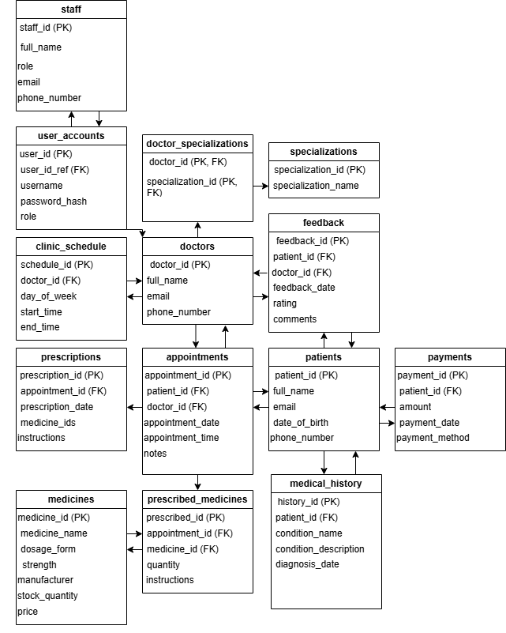

# Clinic Booking System

## Description
A comprehensive database design for managing a modern medical clinic, including:
- Patient management and medical records
- Doctor and staff profiles
- Appointment scheduling
- Prescription and medication tracking
- Payment processing
- Medical history records

## Database Features
- 14 interconnected tables with proper relationships
- Data integrity with foreign key constraints
- Unique constraints for critical fields
- Sample data for testing

## How to Setup
1. Ensure MySQL 8.0 or higher is installed
2. Open Windows Command Prompt or PowerShell
3. Connect to MySQL:
```bash
mysql -u root -p
```
4. Create and populate the database:
```bash
source c:/Users/Wayne/OneDrive/Desktop/Week 8 Database assignment project/Question1_ClinicBookingSystem/schema.sql
source c:/Users/Wayne/OneDrive/Desktop/Week 8 Database assignment project/Question1_ClinicBookingSystem/sample_data.sql
```

## Table Structure
- **patients**: Patient personal information
- **doctors**: Doctor profiles and contact details
- **specializations**: Medical specialties
- **doctor_specializations**: Links doctors to their specialties
- **appointments**: Scheduling and consultation records
- **medicines**: Medication inventory
- **prescribed_medicines**: Prescription details
- **prescriptions**: Complete prescription records
- **staff**: Non-medical staff records
- **payments**: Financial transactions
- **medical_history**: Patient health records
- **clinic_schedule**: Doctor availability
- **feedback**: Patient reviews and ratings
- **user_accounts**: System access management

## ERD


## Sample Queries
```sql
-- Get all appointments for a specific doctor
SELECT a.*, p.full_name as patient_name 
FROM appointments a
JOIN patients p ON a.patient_id = p.patient_id
WHERE doctor_id = 1;

-- View patient prescriptions
SELECT p.full_name, m.medicine_name, pm.instructions
FROM prescribed_medicines pm
JOIN appointments a ON pm.appointment_id = a.appointment_id
JOIN patients p ON a.patient_id = p.patient_id
JOIN medicines m ON pm.medicine_id = m.medicine_id;
```
